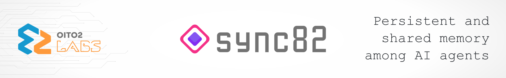

# sync82

<p align="center">
  
</p>

[](https://github.com/oito2/mcp-sync82/actions/workflows/ci.yml)
[](https://pkg.go.dev/github.com/oito2/mcp-sync82)
[](../../go.mod)
[](https://github.com/oito2/mcp-sync82/releases)
[](../../LICENSE)
[](#uso-de-ia-no-projeto)

🌐 **Idioma:** [English](../../README.md) · Português

`sync82` é um servidor [Model Context Protocol (MCP)](https://modelcontextprotocol.io/) que dá a um agente de IA de programação memória persistente e estruturada de um projeto de software entre sessões — objetivos, arquitetura, stack técnica, decisões e progresso, tudo armazenado localmente e recuperado automaticamente na próxima vez que o agente abrir o projeto.

## Índice

- [Visão geral](#visão-geral)
- [Pré-requisitos e instalação rápida](#pré-requisitos-e-instalação-rápida)
- [Configuração dos clientes](#configuração-dos-clientes)
- [Atualização e manutenção](#atualização-e-manutenção)
- [Documentação](#documentação)
- [Uso de IA no Projeto](#uso-de-ia-no-projeto)
- [Licença](#licença)

## Visão geral

A memória é armazenada num banco SQLite embutido e o projeto é distribuído como um binário único e auto-contido — sem toolchain em tempo de execução, sem pacote npm, só o `sync82` no seu `PATH`. O agente lê e escreve essa memória por tools MCP; você conversa com o agente em linguagem natural.

- **Seis arquivos de memória padrão por projeto**, mais qualquer arquivo customizado, para projetos e seus subprojetos (monorepos, ecossistemas de plugins).
- **Descoberta automática do projeto** — um `.sync82.json` no workspace faz com que o agente nunca mais precise dizer o nome do projeto.
- **18 tools MCP** — carregue o contexto inteiro de um projeto numa chamada, salve uma sessão numa chamada, busque no vault inteiro, arquive histórico antigo, exporte/importe Markdown puro.
- **Configuração de clientes em um passo** — `sync82 install` registra o sync82 no Claude Code, Claude Desktop, Antigravity, Codex, OpenCode, Cursor, Zed e Cline; `sync82 uninstall` o remove.
- **Local e privado** — só transporte stdio, nenhum serviço de rede, um arquivo SQLite por vault.
- **Releases verificáveis** — checksums SHA-256, uma assinatura Sigstore e atestações de proveniência de build do GitHub; uma extensão do Claude Desktop (`sync82.mcpb`) e uma entrada no [MCP Registry](https://registry.modelcontextprotocol.io/).

| Arquivo | Tipo | Propósito |
|---|---|---|
| `memory` | sobrescrita | Visão geral do projeto: nome, descrição, objetivo |
| `architecture` | sobrescrita | Componentes e como eles se encaixam |
| `stack` | sobrescrita | Linguagens, frameworks, infraestrutura |
| `decisions` | só-anexa, datado | Decisões tomadas e o porquê |
| `progress` | só-anexa, datado | Trabalho concluído, sessão por sessão |
| `next_steps` | sobrescrita | O que fazer a seguir |

### Tools (18)

O agente de IA chama essas tools via MCP — ele nunca toca o banco de dados diretamente. Referência completa de parâmetros em [Referência de Tools](reference/tools.md).

| Tool | O que faz |
|---|---|
| `list_projects` | Lista todo projeto e subprojeto no vault |
| `create_project` | Cria um novo projeto ou subprojeto |
| `delete_project` | Apaga permanentemente um projeto ou subprojeto (exige confirmação) |
| `rename_project` | Renomeia um projeto ou subprojeto no lugar |
| `get_vault_config` | Reporta o caminho e a config ativa do vault |
| `list_files` | Lista todo arquivo de memória registrado para um projeto |
| `read_memory` | Lê o conteúdo de um arquivo de memória |
| `write_memory` | Sobrescreve o conteúdo inteiro de um arquivo de memória |
| `append_memory` | Anexa uma entrada datada a `progress`, `decisions`, ou um kind customizado de anexação |
| `delete_memory` | Apaga um arquivo de memória customizado (os seis arquivos padrão são protegidos) |
| `archive_memory` | Arquiva entradas datadas antigas, mantendo ativos só os últimos N dias |
| `search_memory` | Busca por substring, sem diferenciar maiúsculas/minúsculas, nos arquivos de memória |
| `load_project_context` | Carrega toda a memória de um projeto num único bloco de contexto |
| `check_project_health` | Reporta quais dos seis arquivos padrão existem |
| `init_project_memory` | Inicialização guiada, com auto-detecção opcional a partir do código |
| `update_project_memory` | Salva o trabalho de uma sessão (progresso, decisões, próximos passos etc.) numa única chamada |
| `export_memory` | Exporta a memória de um projeto para arquivos `.md` em disco |
| `import_memory` | Importa a memória de um projeto a partir de arquivos `.md` — o inverso de `export_memory` |

`list_projects`, `list_files`, `check_project_health` e `search_memory` também devolvem JSON (`format: "json"`). Não sabe bem o que digitar pro seu agente? Veja os [Prompts de Exemplo](prompts.md).

### Comandos de CLI

| Comando | O que faz |
|---|---|
| `sync82` (sem argumentos) | Inicia o servidor MCP via stdio — é isso que seu cliente executa |
| `sync82 install [alvo]` | Conecta o sync82 a um ou todos os clientes MCP suportados |
| `sync82 uninstall [alvo] [--purge]` | Remove o sync82 de um ou de todos os clientes; `--purge` também apaga os arquivos de `~/.sync82` após uma confirmação separada |
| `sync82 config set-vault\|get-vault\|unset-vault` | Gerencia o override global do caminho do vault |
| `sync82 self-update [--check] [--yes] \| --rollback` | Verifica o GitHub Releases e atualiza o binário no lugar (`--rollback` restaura a versão anterior) |
| `sync82 export <projeto> [subprojeto] <pasta-de-saída>` | Extrai a memória de um projeto para arquivos `.md` (`--all` para o vault inteiro) |
| `sync82 import <projeto> [subprojeto] <pasta-de-entrada> [--dry-run]` | Restaura a memória de um projeto a partir de arquivos `.md` (o inverso de `export`); `--dry-run` só mostra o que mudaria |
| `sync82 help` / `--help` / `-h` | Imprime a lista de subcomandos |
| `sync82 version` / `--version` / `-v` | Imprime a versão instalada |

Flags completas, códigos de saída e exemplos de cada comando: [Referência da CLI](reference/cli.md).

## Pré-requisitos e instalação rápida

**Pré-requisitos:** Linux, macOS, ou Windows (amd64/arm64) — um binário de release não precisa de mais nada; compilar a partir do código-fonte exige uma toolchain Go compatível com o [`go.mod`](../../go.mod) (1.26+). Você também vai precisar de um cliente MCP (veja [Configuração dos clientes](#configuração-dos-clientes)). Quem usa o Claude Desktop pode pular esta seção e instalar a [extensão `.mcpb`](#configuração-dos-clientes).

Duas formas de obter o binário em qualquer sistema — as duas funcionam, mas não misture os mecanismos de atualização (veja [Referência da CLI — self-update](reference/cli.md#self-update)).

### Linux

**Binário pré-compilado** (não precisa de toolchain Go):

```bash
curl -LO https://github.com/oito2/mcp-sync82/releases/latest/download/sync82_linux_amd64   # ou sync82_linux_arm64
curl -LO https://github.com/oito2/mcp-sync82/releases/latest/download/checksums.txt
sha256sum -c checksums.txt --ignore-missing   # deve aprovar sync82_linux_amd64 ("OK" ou "SUCESSO")
chmod +x sync82_linux_amd64
sudo mv sync82_linux_amd64 /usr/local/bin/sync82
```

**A partir do código-fonte** (exige Go 1.26+ — baixe em [go.dev/dl](https://go.dev/dl/); pacotes de distribuição como o `golang-go` do Debian/Ubuntu costumam ser mais antigos):

```bash
go install github.com/oito2/mcp-sync82/cmd/sync82@latest
```

### macOS

**Binário pré-compilado** (não precisa de toolchain Go):

```bash
curl -LO https://github.com/oito2/mcp-sync82/releases/latest/download/sync82_darwin_arm64   # Intel: sync82_darwin_amd64
curl -LO https://github.com/oito2/mcp-sync82/releases/latest/download/checksums.txt
grep ' sync82_darwin_arm64$' checksums.txt | shasum -a 256 -c   # deve imprimir "sync82_darwin_arm64: OK"
chmod +x sync82_darwin_arm64
sudo mv sync82_darwin_arm64 /usr/local/bin/sync82
```

**A partir do código-fonte** (exige toolchain Go — `brew install go`):

```bash
go install github.com/oito2/mcp-sync82/cmd/sync82@latest
```

### Windows

**Binário pré-compilado** (não precisa de toolchain Go — PowerShell):

```powershell
$base = "https://github.com/oito2/mcp-sync82/releases/latest/download"
Invoke-WebRequest -Uri "$base/sync82_windows_amd64.exe" -OutFile sync82_windows_amd64.exe
Invoke-WebRequest -Uri "$base/checksums.txt" -OutFile checksums.txt
$expected = ((Select-String -Path checksums.txt -SimpleMatch "sync82_windows_amd64.exe").Line -split '\s+')[0]
if ((Get-FileHash sync82_windows_amd64.exe -Algorithm SHA256).Hash -ne $expected) { throw "checksum não confere" }
New-Item -ItemType Directory -Force "$env:LOCALAPPDATA\sync82" | Out-Null
Move-Item sync82_windows_amd64.exe "$env:LOCALAPPDATA\sync82\sync82.exe"
# adicione $env:LOCALAPPDATA\sync82 ao PATH: Propriedades do Sistema > Variáveis de Ambiente
```

**A partir do código-fonte** (exige toolchain Go — [instalador](https://go.dev/dl/)):

```powershell
go install github.com/oito2/mcp-sync82/cmd/sync82@latest
```

---

Toda release inclui um `checksums.txt` (verificado nos passos acima), um bundle do Sigstore que o assina (`checksums.txt.sigstore.json`) e uma atestação de proveniência de build do GitHub para cada binário e para o bundle `.mcpb` (`gh attestation verify <arquivo> --repo oito2/mcp-sync82`) — veja o [Guia de Instalação](getting-started/installation.md#-verificando-um-binário-baixado).

O `go install`/`go build` já produz o binário final diretamente, pronto pra rodar — garanta que `$(go env GOPATH)/bin` (ou `%GOBIN%`/`$GOBIN`) esteja no seu `PATH`; confira com `which sync82` (`where sync82` no Windows).

## Configuração dos clientes

Registre o sync82 em todo cliente suportado detectado na sua máquina, em um passo:

```bash
sync82 install            # lista os clientes detectados, pede confirmação, configura cada um deles
sync82 install claude     # configura só um cliente específico
```

Alvos: `claude`, `claude-desktop`, `antigravity`, `codex`, `opencode`, `cursor`, `zed`, `cline`. Cada cliente é registrado com o caminho absoluto do binário `sync82` que você executou, então rode `sync82 install` de novo se mover o binário. Cada alvo imprime `configured.` ou `updated.`; um cliente que não é detectado (comando no `PATH` ou diretório de config) é pulado.

**Claude Code** à mão (escopo de usuário, todo projeto):

```bash
claude mcp add --scope user sync82 -- /usr/local/bin/sync82   # o caminho impresso por `which sync82`
claude mcp list
```

**Claude Desktop** — sem precisar do binário: baixe o [`sync82.mcpb`](https://github.com/oito2/mcp-sync82/releases/latest/download/sync82.mcpb) e instale-o no Claude Desktop em **Settings → Extensions → Advanced settings → Extension Developer → Install Extension…**. O sync82 também está listado no [MCP Registry](https://registry.modelcontextprotocol.io/) como `io.github.oito2/mcp-sync82`.

Guias por cliente, com configuração manual e solução de problemas: [Claude Code](guides/clients/claude-code.md) · [Claude Desktop](guides/clients/claude-desktop.md) · [Antigravity](guides/clients/antigravity.md) · [Codex](guides/clients/codex.md) · [OpenCode](guides/clients/opencode.md) · [Cursor](guides/clients/cursor.md) · [Zed](guides/clients/zed.md) · [Cline](guides/clients/cline.md). Qualquer outro cliente só precisa de `command` apontando para o caminho absoluto do binário — veja [Instalador](architecture/installer.md#clientes-fora-desta-lista).

## Atualização e manutenção

```bash
sync82 self-update --check      # informa se existe uma release mais nova, sem instalar
sync82 self-update              # baixa, verifica (SHA-256) e instala a release mais recente
sync82 self-update --rollback   # restaura a versão anterior, guardada como <binário>.bak
```

O `self-update` funciona num binário de release ou num build `go install .../sync82@vX.Y.Z`. Se você instalou com `go install`, atualize com `go install github.com/oito2/mcp-sync82/cmd/sync82@latest` — não misture os dois. A extensão do Claude Desktop é atualizada instalando um `sync82.mcpb` mais novo.

Para remover o sync82 de todos os clientes detectados, rode `sync82 uninstall` (acrescente `--purge` para também apagar o vault padrão e a config em `~/.sync82`) — veja [Desinstalação](getting-started/uninstallation.md) para a remoção completa, binário incluído.

## Documentação

O [site de documentação](index.md) tem todos os detalhes (também em [inglês](../en/index.md)):

- [Instalação](getting-started/installation.md) · [Início Rápido](getting-started/quickstart.md) · [Desinstalação](getting-started/uninstallation.md)
- [Conceitos — Arquitetura](concepts/architecture.md) e [detalhes internos](architecture/context-resolution.md)
- Referência: [Tools](reference/tools.md) · [CLI](reference/cli.md) · [Configuração](reference/configuration.md)
- [Prompts de Exemplo](prompts.md) · [Exemplos de Uso](guides/workflows/examples.md)
- [Solução de Problemas](troubleshooting/common-issues.md)

**Contribuindo:** veja [`contribuindo.md`](contribuindo.md) para o fluxo de desenvolvimento, as checagens que a CI roda (`go build ./...`, `go vet ./...`, `gofmt -l .`, golangci-lint, `go test ./... -race`, `govulncheck`) e como as releases são publicadas. Espera-se que todo participante siga o [Código de Conduta](codigo-de-conduta.md).

## Uso de IA no Projeto

Este projeto contou com o auxílio de ferramentas de IA generativa:

- **Escopo:** Geração de boilerplate, testes unitários e refatoração de funções auxiliares.

- **Supervisão:** Todo o código gerado foi revisado, testado e validado manualmente antes da integração.

## Licença

GPL-3.0 — veja [LICENSE](../../LICENSE).

---

Feito com ❤️ e IA por [Kadu Velasco](https://github.com/kaduvelasco)
